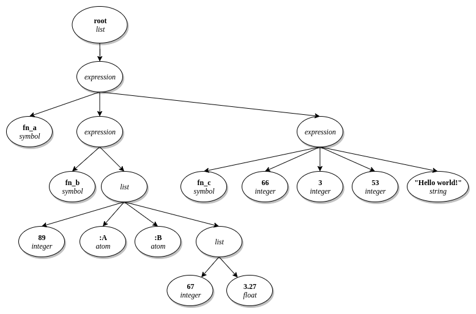

# sexpr [](https://godoc.org/github.com/xiam/sexpr)

<a href="https://github.com/xiam/sexpr/actions?query=workflow%3Aunit-tests"></a>

The `sexpr` package is a Go library that provides a general purpose
[S-expression][1] parser and a lexer. The lexer scans a stream of bytes for a
finite set of patterns (tokens) and identifies lexemes, the parser takes those
lexemes as input and builds abstract syntax trees ([AST][2]) with them.

## What's this for?

ASTs can be used for several purposes:

* Configuration files (like Emacs).
* Representation of a program (try to build your own Lisp interpreter!).
* Representation of lambda terms.
* Build [transformational grammar](https://en.wikipedia.org/wiki/Transformational_grammar) graphs.
* ...or any expression that can be represented as a tree.

### Example

The following *bracketed expression*:

```
[S [N John] [VP [V hit] [NP [D the] [N ball]]]]
```

that corresponds to this [constituency-based parse tree][5]:


could be processed by `sexpr`, converted into an AST for easy manipulation and
then transformed into something else, like XML:

```xml
<list>
  <list>
    <symbol>S</symbol>
    <list>
      <symbol>N</symbol>
      <symbol>John</symbol>
    </list>
    <list>
      <symbol>VP</symbol>
      <list>
        <symbol>V</symbol>
        <symbol>hit</symbol>
      </list>
      <list>
        <symbol>NP</symbol>
        <list>
          <symbol>D</symbol>
          <symbol>the</symbol>
        </list>
        <list>
          <symbol>N</symbol>
          <symbol>ball</symbol>
        </list>
      </list>
    </list>
  </list>
</list>
```

## Subpackages

### Lexer

When a stream of bytes matches any of the following patterns:

`(`, `)`, `[`, `]`, `{`, `}`, `"`, `#`, `[a-zA-Z_]`, `:`, `.`, `\`

a new instance of that token is created and recorded along with the line and
column where the match was found.

#### Example

The following example converts a byte slice into an slice of tokens and prints
details about each one of these tokens:

```go
package main

import (
  ...

  "github.com/xiam/sexpr/lexer"
)

func main() {
  input := `
    (fn_a # comment
      (fn_b [89 :A :B [67 3.27]])
      (fn_c 66 3 53 "Hello world!")
    )
  `

  tokens, err := lexer.Tokenize([]byte(input))
  if err != nil {
    // ...
  }

  for i, tok := range tokens {
    line, col := tok.Pos()
    lexeme := tok.Text()
    tt := tok.Type().String()

    // Example output:
    // token[53] (type: separator, line: 6, col: 1)
    //   -> "\t"
    fmt.Printf("token[%d] (type: %v, line: %d, col: %d)\n\t-> %q\n\n", i, tt, line, col, lexeme)
  }
}
```

For more information see the [list of token types][3].

### Parser

The parser analyzes input from the lexer and tries to build an [AST][2]. The
AST begins with a root (of type `list`) and can branch out nodes of different
types:

| Pattern                    | Type         | Description                                           | Example   |
|----------------------------|--------------|-------------------------------------------------------|-----------|
| `(`...`)`                  | `expression` | A set of items enclosed between paranthesis.          | `(fib 1)` |
| `[`...`]`                  | `list`       | A set of items enclosed between square brackets.      | `[1 2 3]` |
| `{`...`}`                  | `map`        | A set of item pairs enclosed between curly brackets.  | `{:A 65}` |
| `-?[0-9]*`                 | `int`        | An integer. (64-bit)                                  | `123`     |
| `-?[0-9]+\.[0-9]+`         | `float`      | A floating point number. (64-bit)                     | `1.23`    |
| `[a-zA-Z][a-zA-Z0-9_]+`    | `symbol`     | An alphanumeric word.                                 | `hello`   |
| `:[a-zA-Z][a-zA-Z0-9_]+`   | `atom`       | An alphanumeric word preceded by a column.            | `:hello`  |
| `"`...`"`                  | `string`     | Any stream of bytes enclosed between double quotes.   | `"hello"` |

Some nodes can branch out children (*vector nodes*) and some others can only
hold values (*value nodes*).

#### Example

```go
package main

import (
  ...

  "github.com/xiam/sexpr/ast"
  "github.com/xiam/sexpr/parser"
)

func main() {
  input := `(fn_a
    (fn_b [89 :A :B [67 3.27]])
    (fn_c 66 3 53 "Hello world!" 😊))
  `

  root, err := parser.Parse([]byte(input))
  if err != nil {
    log.Fatal("parser.Parse:", err)
  }

  ast.Print(root)
}
```

See the [list of node types][4].

## AST

The following byte stream:

```lisp
(fn_a (fn_b [89 :A :B [67 3.27]]) (fn_c 66 3 53 "Hello world!"))
```

gets transformed into an AST that looks like this:



a text representation of this AST would look like:

```lisp
[
  (
    fn_a
    (
      fn_b
      [
        89
        :A
        :B
        [
          67
          3.27
        ]
      ]
    )
    (
      fn_c
      66
      3
      53
      "Hello world!"
    )
  )
]
```

### AST traversal

The AST always begins with a node of type `list`. In order to traverse an input
stream like:

```lisp
(fn_a (fn_b [89 :A :B [67 3.27]]) (fn_c 66 3 53 "Hello world!"))`
```

you could start with the root node and follow every node, like in the example
below:

```go
func printTree(node *ast.Node) {
  printIndentedTree(node, 0)
}

func printIndentedTree(node *ast.Node, indentationLevel int) {
  indent := strings.Repeat("  ", indentationLevel)
  if node.IsVector() {
    fmt.Printf("%s<%s>\n", indent, node.Type())
    children := node.List()
    for i := range children {
      printIndentedTree(children[i], indentationLevel+1)
    }
    fmt.Printf("%s</%s>\n", indent, node.Type())
    return
  }
  fmt.Printf("%s<%s>%v</%s>\n", indent, node.Type(), node.Value(), node.Type())
}
```

The example above prints a XML-like tree similar to:

```xml
<list>
  <expression>
    <symbol>fn_a</symbol>
    <expression>
      <symbol>fn_b</symbol>
      <list>
        <int>89</int>
        <atom>:A</atom>
        <atom>:B</atom>
        <list>
          <int>67</int>
          <float>3.27</float>
        </list>
      </list>
    </expression>
    <expression>
      <symbol>fn_c</symbol>
      <int>66</int>
      <int>3</int>
      <int>53</int>
      <string>Hello world!</string>
    </expression>
  </expression>
</list>
```

## Examples

* [Lexer](_example/lexer/lexer_example.go)
* [Parser](_example/parser/parser_example.go)
* [AST to XML](_example/xml_format/xml_format_example.go)

[1]: https://en.wikipedia.org/wiki/S-expression
[2]: https://en.wikipedia.org/wiki/Abstract_syntax_tree
[3]: https://godoc.org/github.com/xiam/sexpr/lexer#TokenType
[4]: https://godoc.org/github.com/xiam/sexpr/ast#pkg-constants
[5]: https://en.wikipedia.org/wiki/Parse_tree#Constituency-based_parse_trees
